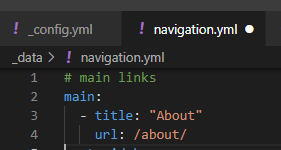
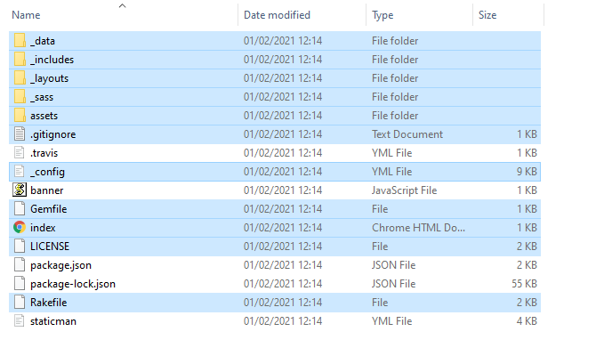
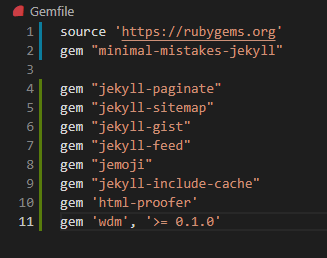
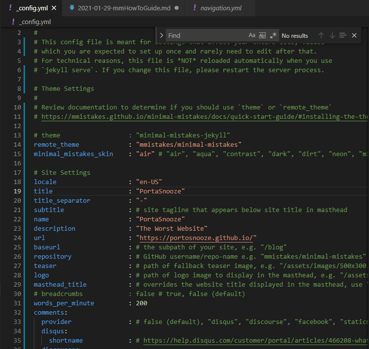
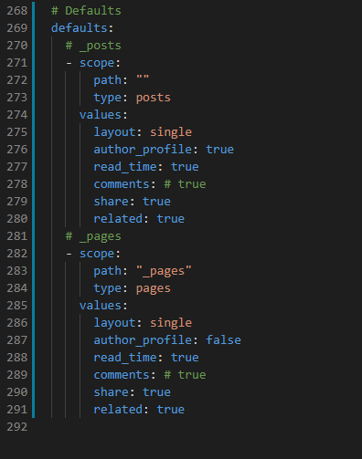
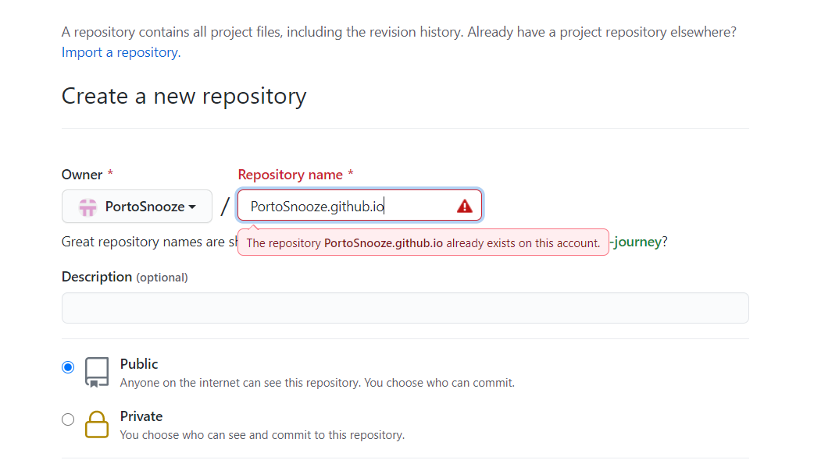
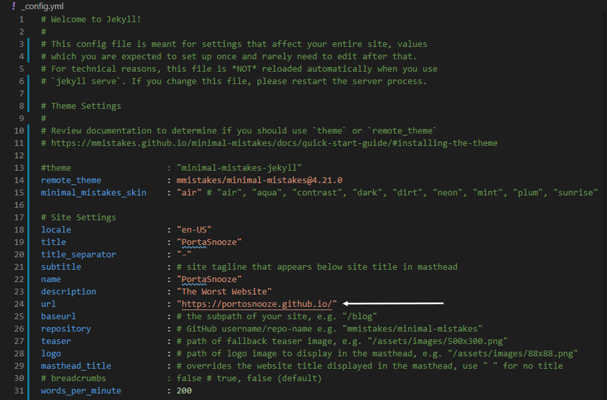
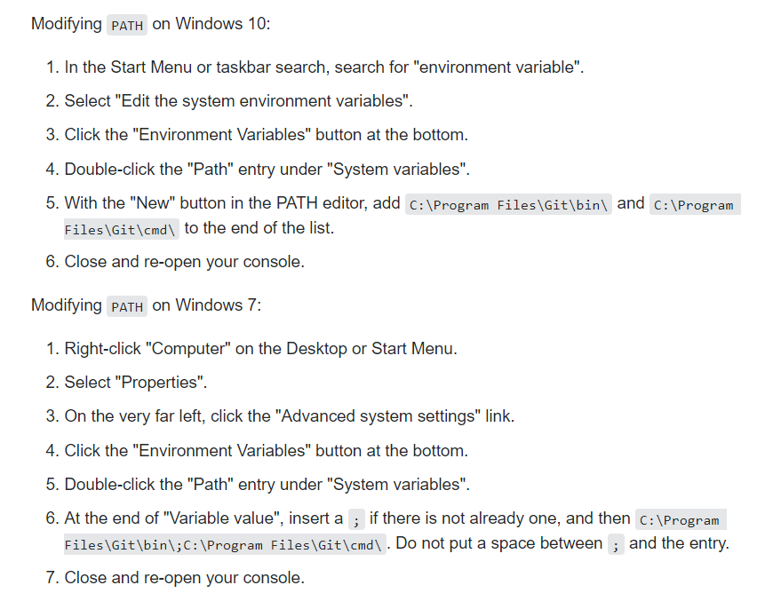
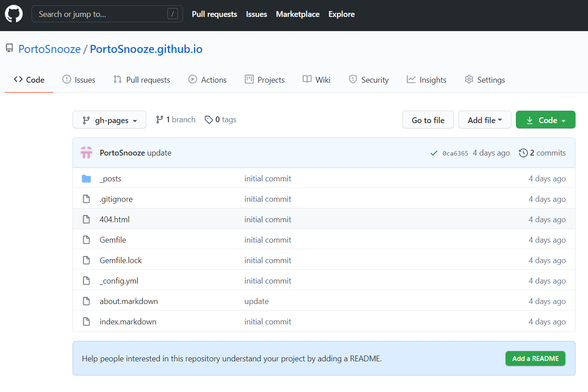
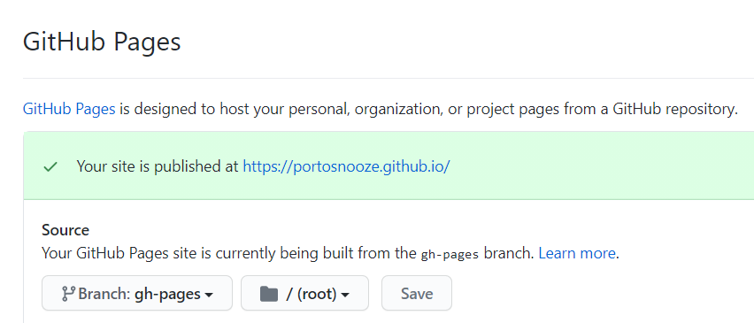

**A basic (like, really basic) guide to creating a blog using GitHub Pages, Jekyll, and Minimal Mistakes**

## Introduction

As king of procrastination, wasting time creating a blog I don't even have recently struck me as the perfect way to while away an afternoon.

After some very superficial Googling I decided that [GitHub Pages][ghPages] and [Jekyll][Jekyll] were the way forward, and I liked the look of the [Minimal Mistakes][jekyllMM] theme, so thought I'd use that too. Easy. I mean, I'd never even heard of GitHub Pages, Jekyll _or_ Minimal Mistakes, and I'm pretty hopeless with computers in general, but several ‘how to’ blogs claimed it was simple and fast to set up, so on I forged. 

After hours of wildly jumping around websites, randomly downloading shit I didn't understand and tying myself in knots, I've learned that's wise to read what's required _before_ starting (I recently read that something is only difficult if you first imagined it would be easy).

My gift to computer-unsavvy humanity is this basic Windows how-to guide, to try and save some other poor souls from my fate.

## Assumed prior knowledge

I've assumed you can vaguely stumble your way around a Windows operating system. I'll not cover things like how to find your downloads folder! 

## "Ingredients"

Just so you're mentally prepared, this is a list of things you'll need to setup/download. _**But hold your horses - don't do this just yet!**_

1) Ruby & Jekyll

2) Visual Studio Code (VSC) 

3) GitHub account

4) Git 

## Step 1: Download Ruby & Jekyll

(I used Jekyll's own [Jekyll on Windows][jekWin] guide to figure this part out.)

First [download Ruby][rubes]. You want to download Ruby+Devkit (whichever version Ruby recommends at the moment). 

Once it's downloaded, open the command prompt with ruby (Windows will give you this option if you search 'Ruby') and enter:


ridik install


Honestly, I have no idea what this means so if you want to delve further go to the [Ruby Install docs][rubesInstallDoc].

Open a new command prompt window and install Jekyll and Bundler using:


gem install jekyll bundler


Bundler installs and tracks the exact Ruby gems (and versions) required. To be honest it goes over my head, but if you're interested, Jacob Aleksynas did a [piece][mediumBundler] on Medium explaining why Bundler came about. All we need to know though is that we use it a lot in this process. 

_Anyway_, typing: 


jekyll -v


should return the version of jekyll you've installed. If there are any problems at this stage, get thee to Google!

## Step 2: Install VSC

Ah, familiar territory! Simply install [Visual Studio Code][VSC] (**VSC**) and go through the usual windows install process (wizard?? Do we still say that?)

## Step 3: Create a Jekyll blog

Here I should credit Arya Murali's ["Guide to github and Jekyll"][20-pc], which leaned on heavily for Steps 3 and 6.

After following these steps you'll have a very basic blog that you can run locally (that just means you can view it privately on your browser). If you want to know how to add your page to GitHub and make it public, go to [Step 6](#st6) after following the instructions here. 

First, start a command prompt with Ruby and navigate to the folder you want your blog to be stored.

{: .notice--success}
>
A _**very**_ basic guide on how to move around a windows filing system:
* `C:` changes to the C directory 
* `dir` lists the folders in the current directory 
* `cd <folder name>` moves up a directory 
* `cd ..` moves down one directory 
* `cd ../..` moves down two directories, etc 
* `cd` +  tab scrolls through the folders available to move to
{: .notice--success}

Create an empty jekyll blog in your desired folder by typing: 


jekyll new <blog name> 


(replacing 'blog name' with your blog name - with no spaces). Changing into your blog's directory and typing `dir` will list the files and folders created. These files contain everything needed to write and publish your blog.

To see what's what, open the folder containing your files in VSC (File > Open Folder).

Before you change anything, open a terminal window in VSC (Terminal > New Terminal) and type: 


bundle exec jekyll serve


This allows you to see the default blog created by Jekyll on your browser ([http://127.0.0.1:4000][local]).

| | | | | | | | | | | | | | | | | | | | | | | | | | | | | 

|**NOTE** | You can change the order of the next steps, depending on what excites you. If you want to know how to create blog content go to [Step 4](#st4), if you want to see how the blog is published publicly via GitHub Pages go to [Step 5](#st5), and if you're more interested in getting Minimal Mistakes to work with your blog go to [Step 6](#st6).

## Step 4: Personalise your blog

Here I'll briefly explain what the most important files and folders do. 

`_posts`:  This folder is very straightforward - it contains your blog posts! Jekyll provides you with a default post so you can get to grips with how they work, but there are a few notable points:

**1)** Posts are named with the date in YYY-MM-DD at the start. *THIS IS IMPORTANT*. Your posts won't publish if you use a different naming convention. 

**2)** Posts are written in markdown language (this is what the .md extension means). I've included some quick-start links at the end of this section if you're not familiar with markdown.

**3)** The text in between the three dashes at the start of the post is called YAML (ain't markup language). This is where you'd put information like the title of your posts, and sets the layout of the webpage (more on that in a bit).

`_site`: All you need to know about this is not to mess with it! The files in here compile your blog but it's done automatically.

`_config.yml`: This file contains information such as your blog's name and the layout used. You can personalise your blog by changing name, description etc etc. Two things to note: 1) you won't have your blog URL yet unless you've been through [Step 6](#st6); 2) this file will be replaced if you want to run Minimal Mistakes (or you'll have to modify it to run MM), so if you make extensive changes, keep a copy somewhere so you remember what you did.  

| | | | | | | | | | | | | | | | | | | | | | | | | | | | | 

|**NOTE** | If you're running your blog on a local server, changes to most files can be viewed by saving the change and refreshing the web page. However, if you make changes to _config.yml you must exit by pressing Ctrl+c and re-run `bundle exec jekyll serve` see the changes made  

`gemfile`: Used for describing Ruby gem dependencies (a dependency is a program that's required to run another program - for example GitHub Pages has a Ruby gem to set up and sync Jekyll environment with GitHub Pages)

`_data`: This contains a file called `navigation.yml`. I got really frustrated at one point trying to figure out how to add an 'about' page to my blog and I realised this is the place to do it (see screenshot below).

 

  _Formatting your posts_

As mentioned above, posts are written in markdown. The default welcome-to-jekyll.markdown post included in the Jekyll download gives you a flavour of how to do this. 

This [markdown guide][mdGuide] is a good markdown starting point, and Minimal Mistakes also has a useful [markup guide][mmMarkupGuide], which shows how to add things like buttons and notice boxes to your page.    

## Step 5: Minimal Mistakes

Minimal Mistakes is a Jekyll theme - that is a template for changing the style and layout of your Jekyll page. Using a theme is absolutely not essential (and there are other themes to choose, if MM doesn't strike your fancy), but I thought I'd include it here because getting it to work caused me some frustration. 

The Minimal Mistakes [quick guide][mmGuide] is very good if you follow it properly, but I was jumping around all over the place and got kinda lost.

I finally managed to piece together what I was missing using [Web Work Tools' Minimal Mistakes & Jekyll Setup and Configuration][webWorkTools] so I've put what I did here. 

First, clone the minimal mistakes repo into a folder (I placed it one-up from my Jekyll blog created in [Step 3](#st3)):


git clone https://github.com/mmistakes/minimal-mistakes.git


In the Minimal Mistakes folder copy the following files across (**NOTE**, this will replace your current `config.yml`, so rename that first if you want to keep it).

{: .notice--warning}
Of course, you may not want to start your `_congig.yml` file from scratch! If this is the case then copy the .html files from the `_layouts` folder, and change your `_config.yml` and `gem` files, making sure your gems are included in the `_config.yml` page. It might take some fiddling to get things running - I found it easier to do it this way to see how it all works.
{: .notice--warning}

Now, in your blog folder, replace the contents of your gemfile with the following

Once saved run the following in this order


bundle install
bundle update 
bundle exec jekyll serve 


You should now have a default version of Minimal Mistakes installed (run `bundle exec jekyll serve` to see what it looks like). 

To make changes and personalise it, we need to amend some of the files we read about in [Step 4](#st4) (don't worry if you skipped straight to this step, I go through the important points here). 

As mentioned in [Step 4](#st4) the `_config.yml` file contains information such as your blog's name, your name etc. You can personalise your blog by changing name, description _etc._ towards the top of the document. 

In addition to adding personal details here, uncomment `remote_theme: "mmistakes/minimal-mistakes"`

There are loads of things you can do with Minimal Mistakes that I've barely started to look into, so you'll have to read up and experiment to make your blog look sleek. 

If you'd like to add an 'about' page to your blog, MM has a useful guide to [working with pages][mmPagesGuide]. The guide is straightforward, but where he mentions [front matter defaults][jekyllFrontMatterDefaults] in step 3, he's referring to the `_config.yml` file. The defaults section is toward the end of the document and should look like this if you want to add pages, in addition to posts:

You also need to adjust the `navigation.yml` in the _data folder if you want an 'About' section (skip back [here](#_dataExp) in Step 4 for an example.

## Step 6: The GitHub bit!

For this step you need to download [git][gitDl] (straightfoward Windows download) and also sign up for [GitHub][github], if you don't already have a profile.  

Next we're going to create a GitHub Pages repository (**repo**) by clicking [New][newRepo]. Name the repo the name you want, plus .github.io, like this: 

Keep the repo as 'public' (you need it to be public so you can see it yourself, unless you pay for a github team plan).

You'll be taken to a scary looking 'quick setup' page but just ignore that for now.

Go back to your blog folder in VSC and add your blog's URL in `_config.yml` under site settings (see screenshot below)

Save the config file, then type the following in the terminal:


git init 


(Side note: I find [this website][atlassian] very useful for explaining git stuff.) 

_____ 

**Note**:

If you're using Windows you may get this error when you try to use git:


'git' is not recognized as an internal or external command,
operable program or batch file. 


You need to add git to your path, as per the instructions on this [Stack Overflow][soAddGitPath] question (I've included a screenshot of the relevant bit below)

If you're using Linux/Mac and you get this message, add git bin and cmd folders to PATH. 

____

GitHub pages uses a special branch in your repository to look for website content, named gh-pages by default. To create this branch type: 


git checkout -b gh-pages


| | | | | | | | | | | | | | | | | | | | | | | | | | | | | 

|`NOTE` | if gh-pages fails you might need to clean up the cache directory, as per [this page][githubCleanUp]

                                  

Next, we need to save a snapshot of your git project in its current state. We do this using a combination of the commands `git status`, `git add`, and `git commit`.

First type


git status


This should show a bunch of files in red, indicating that the files have not yet been added to the staging area.

`git add` tells git that you want to include any updates to a particular file in the next commit. This doesn't actually 'do' anything obvious but it's necessary. 


git add .


(The `.` after add just tells git you want to add all files in the current directory)

Next we want to 'commit' the snapshot of the files we added in the previous step - these can be considered as backups, which will allow you to recover to a previous version of your blog if needed. 


git commit -m "initial commit"


The `-m "initial commit"` part is a note to you to tell you what this change was about - it could say anything! 

Two more steps then it's all done, bear with me!

Git associates your remote repository with a name, which is called `origin` by default. (**Note**: The remote repository is what you've created on GitHub pages. It's a URL where all of the changes you've made on your computer (local repository) are stored online for other people to view and update). 

We now need to let git know the URL of your repository: 


git remote add origin <git repo link>


As an example of what this looks like for my page, I would type 


git remote add origin https://portosnooze.github.io


FINALLY (phew!) type


git push origin gh-pages


The options used here are `git push <remote> <branch>`. This pushes the specified branch (gh-pages), along with any changes, made to the remote repository 

If you go to your GitHub repo you should see all of the files listed in your computer folder on your GitHub, like so:

Click 'settings' and scroll down to GitHub Pages if you're confused as to what your blog's URL is:

And there you have it :) 

I planned to follow these instructions from scratch to test them out, but I've ran out of time. Please let me know in the comments if I've messed up somewhere. 

[20-pc]: https://medium.com/20percentwork/creating-your-blog-for-free-using-jekyll-github-pages-dba37272730a
[mmGuide]: https://mmistakes.github.io/minimal-mistakes/docs/quick-start-guide/
[webWorkTools]: https://web-work.tools/minimal-mistakes/contributors-guide/site-config/
[rubes]: https://rubyinstaller.org/downloads/
[jekWin]: https://jekyllrb.com/docs/installation/windows/
[rubesInstallDoc]: https://github.com/oneclick/rubyinstaller2#using-the-installer-on-a-target-system
[VSC]: https://code.visualstudio.com/download
[local]: http://127.0.0.1:4000/
[sarahPenir]: https://sarahpenir.github.io/
[github]: https://github.com/
[wikiGit]: https://en.wikipedia.org/wiki/Git
[mdGuide]: https://www.markdownguide.org/basic-syntax/
[mmMarkupGuide]: https://mmistakes.github.io/minimal-mistakes/markup/markup-html-tags-and-formatting/
[gitDl]: https://git-scm.com/downloads
[newRepo]: https://github.com/new
[soAddGitPath]: https://stackoverflow.com/questions/4492979/git-is-not-recognized-as-an-internal-or-external-command
[githubCleanUp]: https://www.npmjs.com/package/gh-pages
[atlassian]: https://www.atlassian.com/git
[mmPagesGuide]: https://mmistakes.github.io/minimal-mistakes/docs/pages/
[jThemesPage]: https://jekyllrb.com/docs/themes/
[jekyllFrontMatterDefaults]: https://jekyllrb.com/docs/configuration/front-matter-defaults/
[jekyllMM]: http://jekyllthemes.org/themes/minimal-mistakes/
[ghPages]: https://pages.github.com/
[Jekyll]: https://jekyllrb.com/
[mediumBundler]: https://medium.com/capital-one-tech/ruby-rvm-and-bundler-demystified-9f3f946230f1

